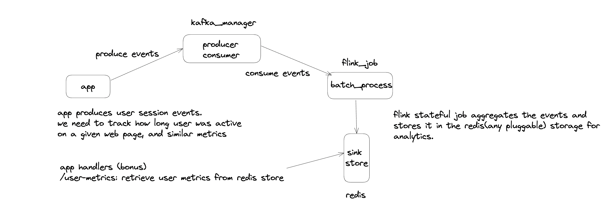

#  Real-time Event Processing with Apache Flink

* Task:

    * Source Setup:
        Implement an event source that simulates events. Use faker module in Go to generate dummy events and push it to Kafka using Kafka Go Client.
    * Event Ingestion and Processing: 
        Develop a Flink job that will consume events in real time from kafka.
        Example event:
        ```
        {
            "timestamp": "2023-09-25T14:30:00",
            "userId": "user123",
            "eventType": "pageView",
            "productId": "product456",
            "sessionDuration": 180
        }
        ```
        Apply transformations, aggregations using window functions calculate overall time spent on the website per user
        Check [this](./events/events.md) for more descriptive event types.

    * Output: Use JDBC sink of Flink and write the output to one of the JDBC compliant database  

* Application can be broken down into the following parts:
    * [producer](./src_producer.go) - events faker. produces to kafka topic.

    * [storage](./storage/) - pluggable sink storage. currently have decided to use redis for its ease of use and running queries.

    * [kafka-manager](./kafka_manager/) - generic kafka manager to support producing and consuming to different topics/consumer groups.

    * [events](./events/) - events package. add support for different events here.

* Overall architecture:

    

* On what basis you will do batch processing/transformations?

    1. `User centric metrics`: metrics stored and sorted by per day timestamps

        * Overall time spent on the website<br>
        * Most common recorded event for a particular user<br>
        * Click-through rates<br>

* How would you do stateful stream processing? (Flinks' DataStream API seems suitable for this approach.)
    * Process and perform aggregations of events in batches depending on the window time set.
    * Incremental processing as new events arrive in the given window, and update the aggregated metrics accordingly.
    * Dump the metrics to some storage sink.
    * Key partitioning based on UserID ensuring events for a particular user are processed by the same flink job.
* 